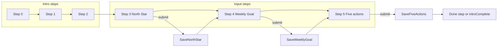

# Journey input steps and saved data

## Current state

- [src/app/page.tsx](src/app/page.tsx): Steps 0–2 are intro copy; steps 3–5 are prompts (“What is your North Star?”, “What’s your next steps for this week?”, “How can we achieve that?”). All steps currently advance on click. No inputs or saved data.

## Data model

Introduce a single shape for the data the player enters, so the fire mechanic can consume it later:

- **North Star** – string  
- **Weekly Goal** – string  
- **Weekly Actions** – array of exactly 5 strings (the “5 actions” for that weekly goal)

Define this as a TypeScript type (e.g. `JourneyData`) and hold it in state in the default `Page` component. Pass it (and a setter or `onSave` callback) into `TitleScreenContent` so input steps can write to it when the user submits.

## Step behavior

- **Steps 0, 1, 2** – Keep current behavior: prompt only, click anywhere (or tap) advances after fade-out. No input.
- **Steps 3, 4, 5** – **Input steps**: show the existing prompt plus:
  - **Step 3**: Single text field (e.g. `<input type="text">` or `<textarea>`) for North Star. Submit button (“Continue” / “Next”) saves to `JourneyData.northStar` and then advances (same fade-out then `onNext` as today).
  - **Step 4**: Single text field for Weekly Goal. Submit saves to `JourneyData.weeklyGoal` and advances.
  - **Step 5**: Five text fields (one per action). Submit saves to `JourneyData.weeklyActions` and advances.

On input steps, do **not** advance on main-area click; only advancing when the user submits avoids losing input and makes “save then next” explicit. Optional: minimal validation (e.g. non-empty) before allowing submit.

## Where state lives

- `**Page` (default export)**  
  - `step` (number)  
  - `journeyData` (object matching `JourneyData`)  
  - `setJourneyData` or a small “update field” helper  
  Pass `step`, `onNext`, `journeyData`, and a save callback into `TitleScreenContent`.
- `**TitleScreenContent**`  
  - For steps 3–5, render prompt + input(s) + submit button.  
  - On submit: update the passed-in journey data, then call the same exit flow you use now (e.g. set `isExiting` and then `onNext` in `onAnimationEnd`).  
  - No need to duplicate journey data in local state; use controlled inputs bound to props/callback.

## After the last input (step 5)

Once the user submits step 5, advance to a “completed” state. Options:

- **A)** One more step (e.g. step 6): “You’re set” / summary and a button like “Start” that later goes to the fire screen.  
- **B)** Set an `introComplete` (or similar) flag and conditionally render a placeholder “main” view (e.g. “Fire mechanic coming soon”) instead of the intro.

Plan for **A** in code (one more step with a CTA) and mention **B** in the Markdown doc as an alternative. No fire mechanic implementation in this task.

## UI and accessibility

- Use `<label>` (or `aria-label` / `aria-labelledby`) for each input so screen readers and focus order are clear.
- Reuse existing classes where it fits (e.g. prompt text keeps `journey-title`-style); add minimal new styles in [src/app/page.css](src/app/page.css) for inputs and the submit button so they match the current look (e.g. dark background, readable text).
- Submit button: visible and keyboard-activable; on input steps it’s the primary way to advance.

## Persistence (later)

- Keep storage **in-memory** for this task: `useState` in `Page` is enough. The Markdown doc will describe how the same `JourneyData` shape can later be written to localStorage, an API, or a “database” and how the fire mechanic will read it. No API or DB calls in this implementation.

## Multi-user and DB schema (future)

At some point the app will support multiple users. Each user holds their own copy of the journey data (North Star, Weekly Goal, 5 actions, etc.). Plan for a **User-centric** DB schema that is **flexible** so you can add fields later without big rewrites.

**Proposed schema (one row/document per user):**

| Field              | Type                    | Notes                                                                                                                                                                          |
| ------------------ | ----------------------- | ------------------------------------------------------------------------------------------------------------------------------------------------------------------------------ |
| `id`               | string (UUID) or auto   | Primary key; stable per user.                                                                                                                                                  |
| `name`             | string                  | User’s display name (required for now).                                                                                                                                        |
| `email`            | string, nullable        | Add later when you do auth/notifications.                                                                                                                                      |
| `journeyData`      | object (JSON)           | The `JourneyData` shape: `northStar`, `weeklyGoal`, `weeklyActions` (array of 5 strings). Stored as one blob so the shape can evolve (e.g. add fields) without new DB columns. |
| `meta` or `extras` | object (JSON), optional | Flexible bucket for future fields (e.g. preferences, fire state, last active, settings). Add keys as needed; no schema change required.                                        |

**Why this stays flexible:**

- `**journeyData` as one JSON object** – New fields (e.g. “previous North Stars”, “weekly start day”) live inside the same object; you only change the TypeScript type and the code that reads/writes it, not the DB schema.
- `**meta` / `extras**` – For anything that isn’t strictly “journey” (e.g. onboarding flags, theme, fire mechanic state). You can add and document new keys over time; the DB stays one “user” table/collection.

**Implementation note:** This task does **not** implement the DB or multi-user. The in-app type `JourneyData` should match the shape you’ll store in `user.journeyData`. The Markdown doc will include this schema so when you add a real DB (e.g. SQLite, Postgres, or a BaaS), you have a clear target.

## Markdown documentation

Add a single Markdown file in **temp**: `temp/journey-data-and-flow.md`. It should include:

1. **Step flow** – Numbered list of steps (0–5 and the “done” step): what the user sees and whether it’s click-only or input + submit.
2. **Data shape** – The three saved fields (North Star, Weekly Goal, 5 actions), with type/schema in text or a small code block.
3. **Where it’s stored** – “Lives in React state in the page component; later can be moved to localStorage / API / DB.”
4. **Multi-user DB schema** – Summary of the User-centric schema (id, name, email later, journeyData object, meta/extras for flexibility) so the doc doubles as the schema spec when you add a real DB.
5. **How the fire mechanic will use it** – Short section (placeholder): e.g. “The fire mechanic will read `JourneyData` to drive [behavior to be defined]. North Star might influence X, weekly goal and actions might influence Y. Implementation deferred.”

No code in the Markdown beyond the optional schema snippet; the doc explains how the flow and data work and how they connect to the future fire mechanic.

## Files to touch

| File                                                                | Changes                                                                                                                                                                                                                                                         |
| ------------------------------------------------------------------- | --------------------------------------------------------------------------------------------------------------------------------------------------------------------------------------------------------------------------------------------------------------- |
| [src/app/page.tsx](src/app/page.tsx)                                | Add `JourneyData` type and state in `Page`; pass `journeyData` and save callback to `TitleScreenContent`. For steps 3–5, render input(s) + submit; submit saves and triggers exit/onNext. Optionally step 6 “done” + CTA. Disable click-advance on input steps. |
| [src/app/page.css](src/app/page.css)                                | Styles for text input(s) and submit button (optional: focus states, spacing) so they fit the existing journey screen.                                                                                                                                           |
| New: [temp/journey-data-and-flow.md](temp/journey-data-and-flow.md) | Step flow, data shape, DB schema summary, where data lives, and “how fire mechanic will use this data” placeholder. All Markdown docs for this app live in `temp/` (see also [temp/roadmap-1.0.md](temp/roadmap-1.0.md)).                                       |

## Flow sketch

## Out of scope for this plan

- Fire mechanic implementation.
- Persistence to localStorage/API/DB (only in-memory state for now).
- Multi-user backend and DB implementation (schema is planned and documented; implementation later).
- Name/email or other fields from the TO DO LOG; this plan only adds North Star, Weekly Goal, and 5 actions (name/email fit into the future User schema when you add it).

